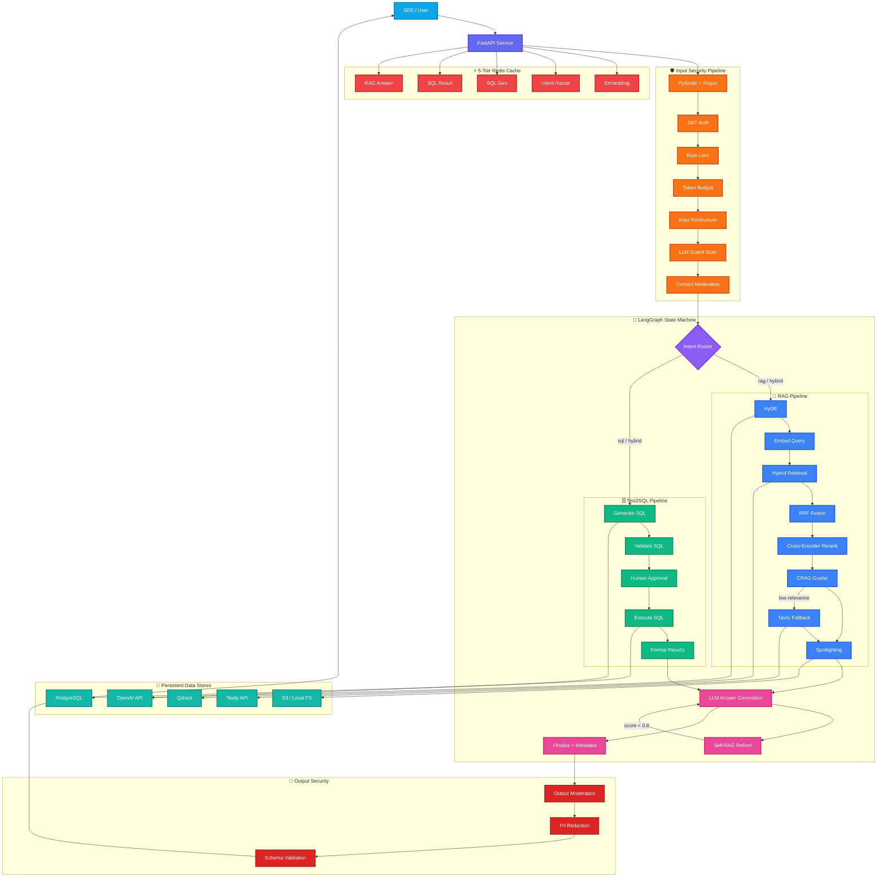

# Enterprise Advanced RAG — Kubernetes SRE Copilot :CorexRAG

> LangGraph · Hybrid Search · CRAG · Self-RAG · Text2SQL (HITL) · 5-Tier Cache · 9-Layer Guardrails

A production-grade RAG system for Kubernetes IT operations built with FastAPI, LangGraph, Qdrant, PostgreSQL, Redis, and Streamlit.

## Architecture

```
SRE/User → FastAPI → 9-Layer Input Security → LangGraph State Machine
                                                   ├── RAG Pipeline (HyDE → Hybrid Retrieval → RRF → Rerank → CRAG → Self-RAG)
                                                   └── Text2SQL Pipeline (GPT-4o → Validate → HITL → Execute)
                                               → 5-Tier Redis Cache → Response
```
# 🔄 Workflow Diagram


## Quick Start

```bash
# 1. Install dependencies
pip install -r requirements.txt

# 2. Copy and fill environment variables
cp .env.example .env

# 3. Start infrastructure
docker-compose up -d

# 4. Seed data (K8s docs)
python scripts/seed_data.py

# 5. Run API
uvicorn app.main:app --reload

# 6. Open Streamlit UI
streamlit run app/ui/streamlit_app.py
```

## Project Structure

```
enterprise-rag/
├── app/
│   ├── main.py                  # FastAPI entrypoint
│   ├── api/
│   │   ├── routes.py            # REST endpoints
│   │   └── models.py            # Pydantic request/response models
│   ├── core/
│   │   ├── graph.py             # LangGraph state machine
│   │   ├── intent_router.py     # rag / sql / hybrid routing
│   │   └── state.py             # Graph state schema
│   ├── pipelines/
│   │   ├── rag/
│   │   │   ├── hyde.py          # Hypothetical Document Embeddings
│   │   │   ├── retrieval.py     # Hybrid retrieval (Dense + BM25)
│   │   │   ├── rerank.py        # Cross-encoder reranking
│   │   │   ├── crag.py          # CRAG grader + web fallback
│   │   │   ├── self_rag.py      # Self-RAG reflection loop
│   │   │   └── spotlighting.py  # XML-delimited context
│   │   └── sql/
│   │       ├── generator.py     # Text2SQL with GPT-4o
│   │       ├── validator.py     # SELECT-only + blocklist
│   │       └── executor.py      # Postgres execution
│   ├── cache/
│   │   └── redis_cache.py       # 5-tier TTL cache (Upstash)
│   ├── guardrails/
│   │   ├── input_pipeline.py    # 9-layer input security
│   │   └── output_pipeline.py   # Output moderation + PII redaction
│   └── utils/
│       ├── embeddings.py        # text-embedding-3-small wrapper
│       └── llm.py               # GPT-4o wrapper
├── scripts/
│   ├── seed_data.py             # Ingest K8s docs into Qdrant
│   └── run_evals.py             # Ragas evaluation suite
├── tests/
│   └── test_pipeline.py
├── docker-compose.yml
├── Dockerfile
├── requirements.txt
└── .env.example
```

## Sections Covered

| # | Topic | Key Techniques |
|---|-------|----------------|
| 1 | Project Intro | Architecture overview |
| 2 | Skeleton + Evals | UV, Docker, Ragas |
| 3 | Basic RAG | Qdrant, embeddings |
| 4 | Hybrid Search | Dense + BM25, RRF |
| 5 | ReRanking | BGE / Voyage AI cross-encoder |
| 6 | HyDE | 3 hypothetical answers |
| 7 | CRAG | Relevance grading, web fallback |
| 8 | Self-RAG | Score-based regeneration |
| 9 | Text2SQL | GPT-4o, HITL approval |
| 10 | Caching | 5-tier Redis TTL |
| 11 | Guardrails | 9-layer security pipeline |
